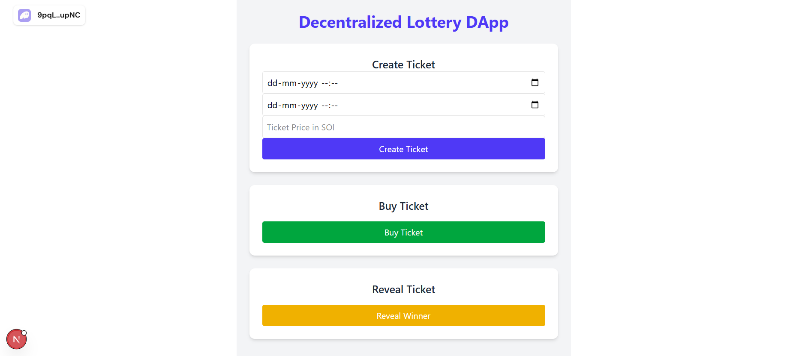

# 🎟️ Lottery Ticket 

**Lottery Ticket** is a decentralized lottery system built using **Solana**, **Anchor**, and **Next.js**. This project combines the power of smart contracts with a modern frontend to ensure a transparent, secure, and user-friendly lottery experience.

Built for a hackathon, this project demonstrates how blockchain can revolutionize traditional systems by eliminating intermediaries and enhancing trust through decentralization.

---



## 🚀 Features

- 🎫 **Create Lottery Tickets**  
  Smart contract-enabled ticket generation stored on-chain.

- 💰 **Buy Tickets**  
  Anyone can participate by purchasing available tickets using their wallet.

- 🔍 **Reveal Winners**  
  Fully transparent winner selection using the smart contract logic.

- 🌐 **DApp UI**  
  Built with Next.js for seamless interaction with the blockchain in real-time.

---

## 📦 Tech Stack

| Layer     | Tech Used                        |
|-----------|----------------------------------|
| Blockchain | Solana, Anchor (Rust framework) |
| Frontend  | Next.js, TailwindCSS, Wallet Adapter |
| Backend   | Anchor Smart Contract (Rust)     |
| Tools     | Solana CLI, Yarn, Local Validator |

---

## 🌍 Why Blockchain for Lottery?

Traditional lottery systems suffer from issues like:

- **Lack of transparency** in the draw process  
- **Centralized control**, risking manipulation  
- **Delayed payouts and verification**

By using **blockchain**, we solve these problems:

✅ Transparent & verifiable draw  
✅ Immutable smart contract logic  
✅ Instant settlement of prizes  
✅ No central authority  
✅ Fair and trustless participation  

---
---

## ⚙️ Getting Started

Follow these steps to set up the project locally.

###  Clone the Repository

```bash
git clone https://github.com/Sahu-sunil-cpu/Lottery-Contract.git
cd lottery-ticket
```

###  Install Dependencies

```bash
npm install
or
yarn install
or
pnpm install
```

###  Build the lottery smart contract
```bash
cd anchor
anchor build
```

### Run the Frontend
Back in the root directory:

```bash
yarn dev
```

### Testing Smart Contracts
Anchor tests are available in the anchor/tests/ folder. You can run them using:

```bash
cd anchor
anchor test
```

## 🙌 Contribution
Contributions are welcome! Please fork the repo and submit a pull request.

